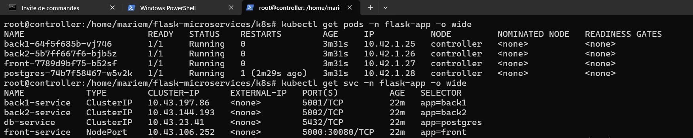
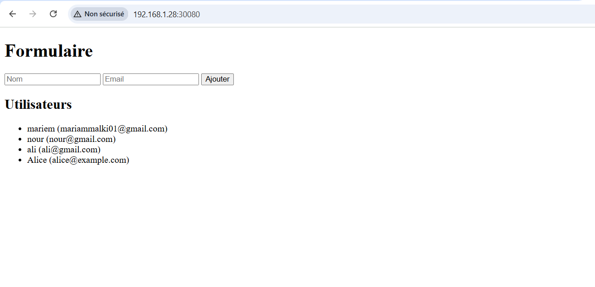
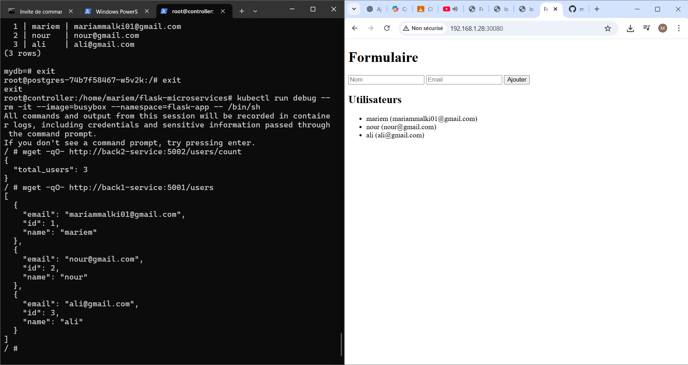
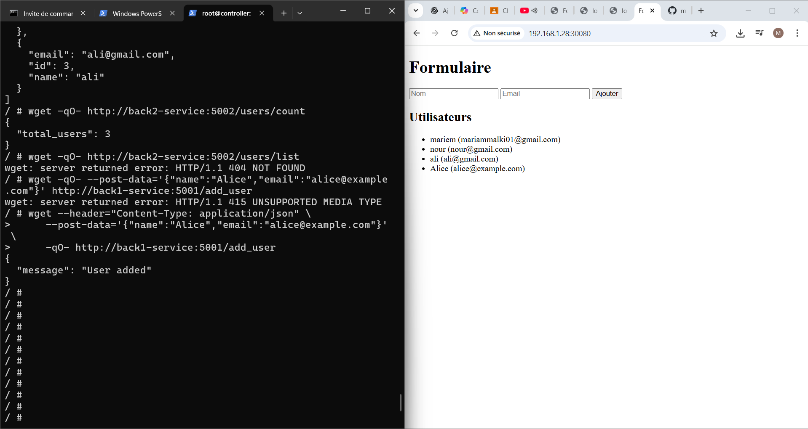
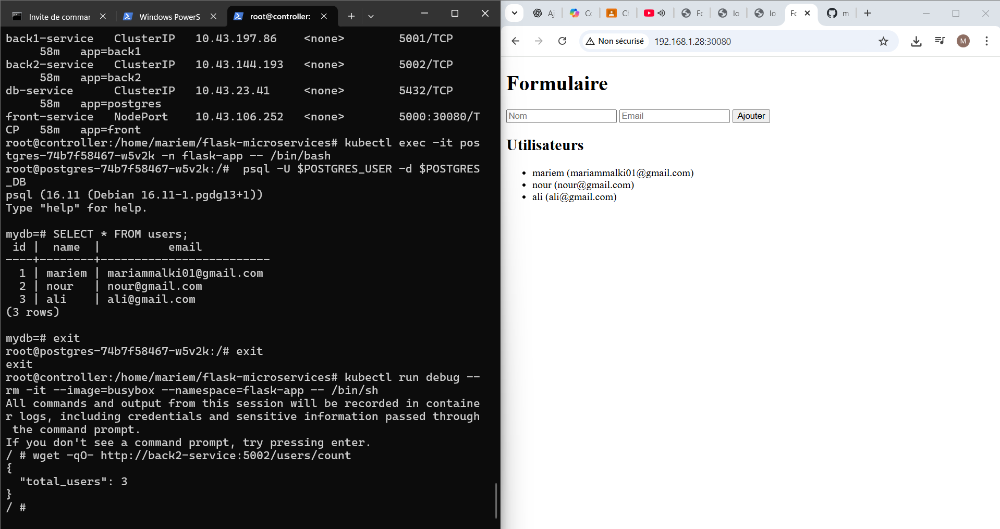
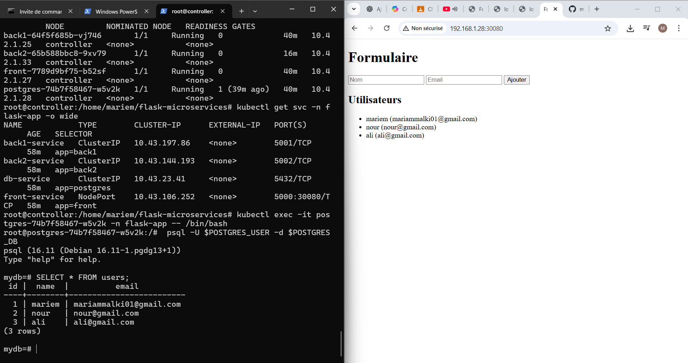
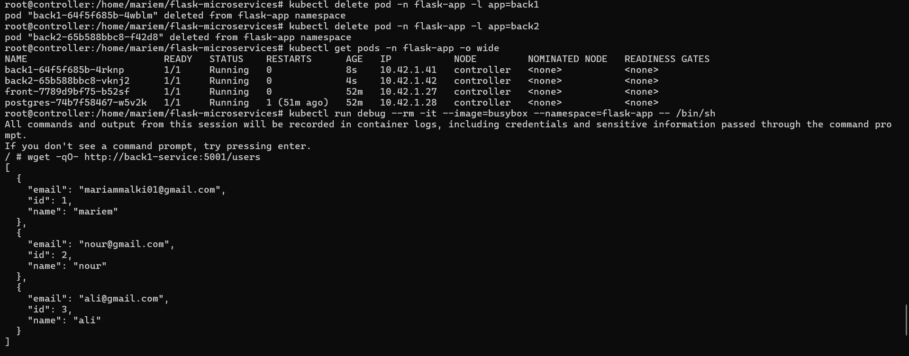

# Flask Microservices avec PostgreSQL sur Kubernetes

Ce projet est une démonstration de **microservices Flask** orchestrés sur **Kubernetes**, utilisant **PostgreSQL** pour la persistance des données. Il comprend :

- **back1** : microservice pour gérer les utilisateurs (`/users`, `/add_user`)
- **back2** : microservice pour compter les utilisateurs (`/users/count`) 
- **front** : interface web pour ajouter et visualiser les utilisateurs
- **postgres** : base de données PostgreSQL pour stocker les utilisateurs

---

## Structure du projet
FLASK-MICROSERVICES/
├─ back1/
│  ├─ app.py
│  ├─ Dockerfile
│  └─ requirements.txt
├─ back2/
│  ├─ app.py
│  ├─ Dockerfile
│  └─ requirements.txt
├─ docs/
├─ front/
│  ├─ templates/
│  ├─ app.py
│  ├─ Dockerfile
│  └─ requirements.txt
├─ k8s/
│  ├─ back1-deployment.yaml
│  ├─ back2-deployment.yaml
│  ├─ configmap.yaml
│  ├─ front-deployment.yaml
│  ├─ namespace.yaml
│  ├─ postgres-deployment.yaml
│  ├─ postgres-pv-pvc.yaml
│  ├─ postgres-secret.yaml
│  └─ postgres-service.yaml
└─ README.md

---

## Déploiement sur Kubernetes

### 1. Créer le namespace

kubectl apply -f k8s/namespace.yaml
2. Déployer PostgreSQL

kubectl apply -f k8s/postgres-deployment.yaml
kubectl apply -f k8s/postgres-service.yaml
kubectl apply -f k8s/postgres-pvc.yaml
3. Déployer back1 et back2

kubectl apply -f k8s/back1-deployment.yaml
kubectl apply -f k8s/back2-deployment.yaml

4. Déployer le front-end

kubectl apply -f k8s/front-deployment.yaml

5. Vérifier que tous les pods tournent

kubectl get pods -n flask-app -o wide
kubectl get svc -n flask-app

Test des microservices
-Front-end (interface web)
Depuis la machine hôte :
curl http://localhost:30080
Ajouter un utilisateur via le formulaire

Vérifier que la liste s’actualise

-Back1

kubectl run debug --rm -it --image=busybox --namespace=flask-app -- /bin/sh
# Dans le pod debug
wget -qO- http://back1-service:5001/users

apk add curl
curl -X POST http://back1-service:5001/add_user \
     -H "Content-Type: application/json" \
     -d '{"name":"Alice","email":"alice@example.com"}'

-Back2

wget -qO- http://back2-service:5002/users/count

-db

Vérification de la persistance
Ajouter quelques utilisateurs via le front-end ou back1.

Redémarrer les pods back1 et back2 :

kubectl delete pod -l app=back1 -n flask-app
kubectl delete pod -l app=back2 -n flask-app
kubectl get pods -n flask-app
Vérifier que les données sont toujours accessibles via back1 et back2 :

wget -qO- http://back1-service:5001/users
wget -qO- http://back2-service:5002/users/count
Les données doivent persister grâce au PersistentVolumeClaim pour PostgreSQL.

